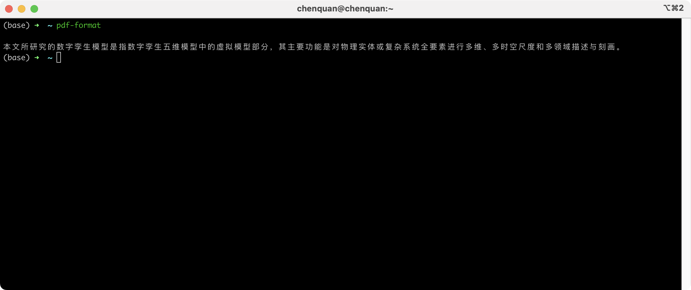
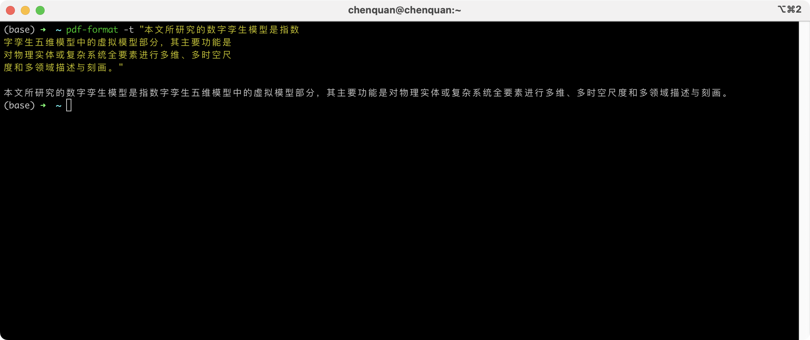

# pdf-format
<a href="https://www.buymeacoffee.com/chenquan"></a>

[](https://github.com/chenquan/pdf-format)
[](https://github.com/chenquan/pdf-format)
[](LICENSE)


💥A tool to format PDF text. (Linux, MacOS and Windows)





## 😜installation

```shell
go install github.com/chenquan/pdf-format@latest
```

or [download](https://github.com/chenquan/pdf-format/releases).
